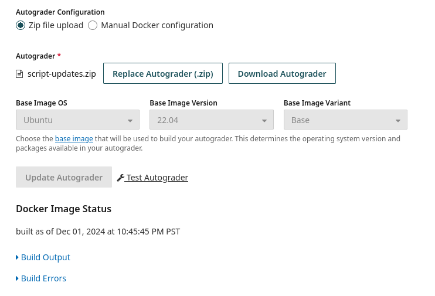
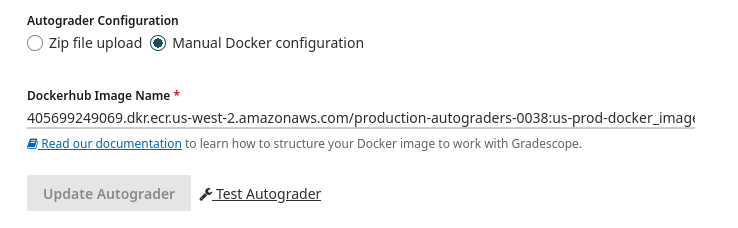
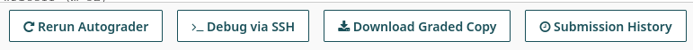

## Setting up Gradescope Autograder for Programming assignments

Gradescope autograder executes inside a Docker container on an Amazon AWS Virtual Machine (VM).

What is a Docker container?
- Container only has access to filesystem and memory of itself 
- Not meant to reach out to the host OS

The container itself is a standard Linux environment. Specificaly, a recent distribution of Ubuntu.


### Initial Setup

Important files:

- setup.sh
    - Script that runs once when the VM is initialized
    - Used to install dependencies needed for grading
    - Install language runtime how you would normally on Linux (via APT package manager or shell script)
        - Python: Python interpreter, Pip package manager and any Pip dependencies
        - Java: Javac compiler and Java Virtual Machine
        - Javascript: NodeJS runtime
        - Go: Go compiler 
        - Rust: Rustup which includes cargo and Rust compiler 
    - Pull any scripts that your grading depends on
        - Maybe you have extra grading utilities in a different repo 
- run_autograder
    - Script that runs on every submission
    - Runs your grading sequence
    - Outputs the results to `/autograder/results/results.json`


### Uploading Autograder

#### Manual Zip Archive

Add `run_autograder`, `setup.sh` and any other scripts or files that your autograder needs to a zip archive.

Upload that zip to Gradescope on the Configure Autograder page of your assignment:




#### Docker image

For this example grader you can build the Docker image with the following command:
```sh
docker build -t gradescope-autograder -f Dockerfile .
```

Push to DockerHub
```sh
docker push gradescope-autograder
```

Add the image name with tag from your DockerHub on the Configure Autograder page of your assignment: 



### Running autograder


### Making updates to the autograder

It's very likely you might find yourself updating the autograder scripts after initially uploading them. Here's what you can do to update the autograder and reflect the changes across any existing submissions.


### Debugging locally

You can enter the container's shell with this commmand. "gradescope-autograder" is the name of the docker image we built earlier. Note how we are mounting the submission directory. We can mount a different directory if we have a different student's submissions.
```sh
docker run -it -v ./submission/:/autograder/submission gradescope-autograder /bin/bash
```

Make sure you're in the `/autograder` directory and run the autograder script:
```sh
./run_autograder
```

View the results at `/autograder/results/results.json`:
```sh
cat /autograder/results/results.json
```

### Debugging via SSH

One extremely handy tool is the SSH Debugging feature on the Gradescope website.

Click this "Debug via SSH" button: 



It'll ask you for your ssh public key. If you don't have one, you can generate it via the command `ssh-keygen` and view it at `~/.ssh/id_rsa.pub` (might be a different file in `~/.ssh`).

Then you can copy the ssh command it gives you and run that to enter the AWS VM that is running your Docker container.